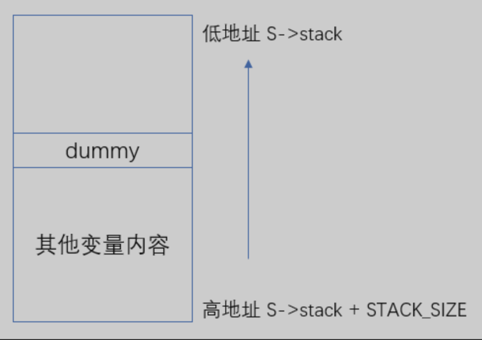
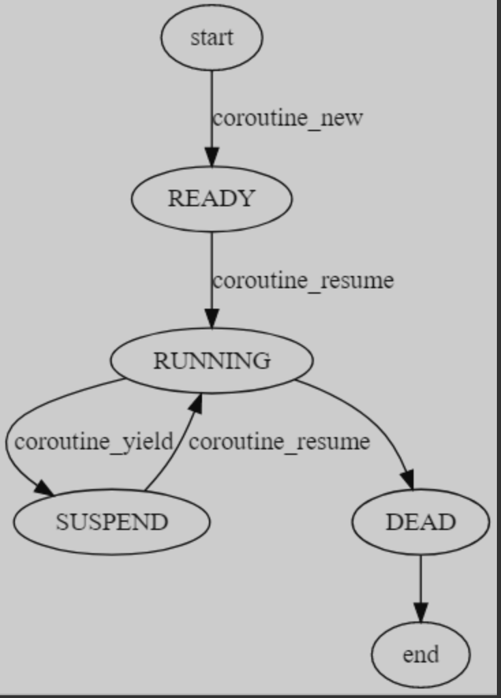
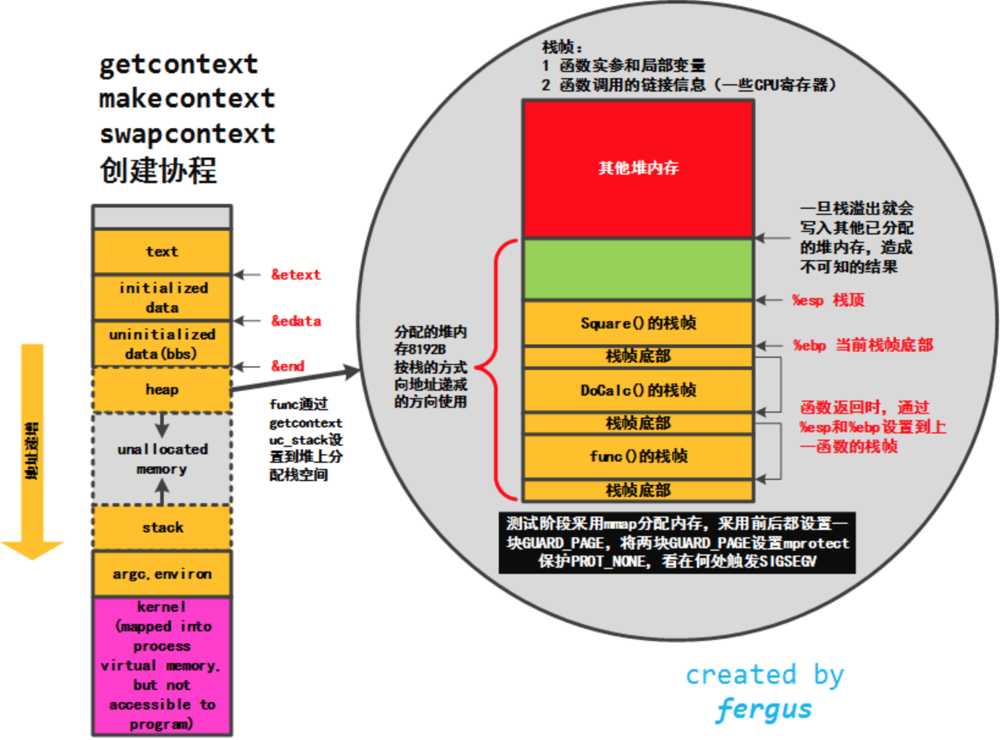

## 背景
协程主要有两大优点：
1. 相比线程更加轻量级；
   * 线程的创建和调度都是在内核态，而协程是在用户态完成；
   * 线程数受限于`CPU`核数，线程过多会造成大量的核间切换，而协程则无需考虑这些。

2. 异步流程同步化处理。

协程分为有栈协程和无栈协程。
有栈协程原理：
一个程序真正运行起来，需要两个因素：可执行代码段和数据。在`CPU`方面主要包含以下方面：
* `EIP`寄存器：用来存储`CPU`要读取指令的地址；
* `ESP`寄存器：用来存储当前线程栈的栈顶位置；
* 其他通用寄存器的内容：包含代表函数的`rdi、rsi`等；
* 线程栈中的内容。

这些数据内容，我们统称为上下文或现场。
有栈协程的原理：从线程的上下文下手，把线程的上下文全部改变。
`Linux`提供了一套函数，`ucontext`用来获取和设置当前线程的上下文。
### `coroutine`使用方法
```cpp
#include "../coroutine/coroutine.h"
#include <stdio.h>

struct args {
  int n;
};

static void foo(struct schedule *S, void *ud) {
  struct args *arg = (struct args *)ud;
  int start = arg->n;
  int i;
  for (i = 0; i < 5; i++) {
    printf("corutine %d: %d\n", coroutine_running(S), start + i);

    //切出当前协程
    coroutine_yield(S);
  }
}

static void test(struct schedule *S) {
  struct args arg1 = {0};
  struct args arg2 = {100};

  // 创建两个协程
  int col1 = coroutine_new(S, foo, &arg1);
  int col2 = coroutine_new(S, foo, &arg2);

  printf("main start\n");
  while (coroutine_status(S, col1) && coroutine_status(S, col2)) {
    // 使用协程1
    coroutine_resume(S, col1);
    // 使用协程2
    coroutine_resume(S, col2);
  }

  printf("main end\n");
}

int main() {
  // 创建一个协程调度器
  struct schedule *S = coroutine_open();

  test(S);

  // 关闭协程调度器
  coroutine_close(S);

  return 0;
}
```
首先利用`coroutine_open`创建一个协程调度器S，用来统一管理全部的协程。
同时在 test 函数中，创建了两个协程 co1 和 co2，不断的反复 yield 和 resume 协程，直至两个协程执行完毕。

最核心的几个对象和函数是：
1. `struct schedule *S`协程调度器；
2. `coroutine_resume(S,col1)`切入该协程；
3. `coroutine_yield(S)`切出该协程。

### `struct schedule`协程调度器
```cpp
struct schedule{
   char stack[STACK_SIZE]; // 运行时栈，此栈即共享栈
   ucontext_t  main; // 主协程的上下文
   int nco; // 当前存活的协程数
   int cap; // 协程管理器的最大容量，即可以同时支持多少个协程，如果不满足要求，进行两倍扩容
   int running; // 正在运行的协程
   struct coroutine **co; // 一个一维数组，用于存放所有协程，长度为cap
};
```
此外`coroutine_open`负责创建并初始化一个协程调度器，`coroutine_close`负责销毁协程调度器，以及清理所管理的所有协程。
```cpp
// 删除一个协程
void _co_delete(struct coroutine *co){
   free(co->stack);
   free(co);
}


// 创建一个协程调度器
struct schedule *coroutine_open(){
   // 分配内存，赋初值
   struct schedule *S = malloc(sizeof(*S));
   S->nco = 0;
   S->cap = 16;
   S->running = -1;
   S->co = malloc(sizeof(struct coroutine *) * S->cap);
   memset(S->co, 0, sizeof(struct coroutine * )* S->cap);

   return S;
}

// 关闭协程调度器，同时清理其负责管理的协程
void coroutine_close(struct schedule *S) {
   int i;
   // 关闭掉每一个协程
   // 如果有协程正在运行，直接free，会不会出问题？
   for(i = 0; i < S->cap; i++){
      struct coroutine *co = S->co[i];

      if(co) {
         _co_delete(co);
      }
   }

   // 释放掉
   free(S->co);
   S->co = nullptr;
   free(S);
}
```


### 协程的创建
```cpp
struct coroutine{
   coroutine_func func; // 协程所用的函数
   void *ud; // 协程所用的参数
   ucontext_t ctx; // 协程上下文
   struct schedule *sch; // 该协程所属的调度器
   ptrdiff_t cap; // 已经分配的内存大小
   ptrdiff_t size; // 当前协程运行时栈，保存起来后的大小
   int status; // 协程当前状态
   char *stack;// 当前协程的保存起来的运行时栈
};
```
`coroutine_new`创建一个协程：
```cpp
// 新建一个协程，做初始化
struct coroutine *_co_new(struct schedule *S, coroutine_func func, void *ud) {
   struct coroutine *co = malloc(sizeof(*co));
   co->func = func;
   co->ud = ud;
   co->sch = S;
   co->cap = 0;
   co->size = 0;
   co->statuc = COROUTINE_READY; // 默认创建协程状态
   co->stack = NULL;
   return co;
}

/**
* 创建一个协程对象
* @param S 该协程所属的调度器
* @param func 该协程函数执行体
* @param ud func的参数
* @return 新建的协程的ID
*/
int coroutine_new(struct schedule *S, coroutine_func func, void *ud){
   struct coroutine *co = _co_new(S, func, ud);
   if(S->nco >= S->cap){
      // 空间不足，进行扩容
      int id = S->cap; // 新的协程id为当前容量大小
      // 扩容方式是直接扩大2倍
      S->co = realloc(S->co, S->cap * 2 * sizeof(struct coroutine *));

      // 初始化内存
      memset(S->co+S->cap, 0, sizeof(struct coroutine *) * S->cap);
      // 将协程放入调度器
      S->co[S->cap] = co;
      // 容量扩大为2倍
      S->cap *= 2;

      // 尚未结束运行的协程个数
      ++S->nco;
      return id;
   } else {
      // 如果当前协程数小于调度器容量，则取一个为NULL的位置，翻入新的协程
      int i;
      for(i = 0; i < S->cap; i++) {
         /* 
			 * 为什么不 i%S->cap,而是要从nco+i开始呢 
			 * 这其实也算是一种优化策略吧，因为前nco有很大概率都非NULL的，直接跳过去更好
			*/
         int id = (i + S->nco) % S->cap;
         if(NULL == S->co[id]) {
            S->co[id] = co;
            ++S->nco;
            return id;
         }
      }
   }

   assert(0);

   return -1;
}
```
* 扩容：当目前尚存活的线程个数 nco 已经等于协程调度器的容量 cap 了，这个时候需要对协程调度器进行扩容，这里直接就是非常经典简单的 2 倍扩容。
* 如果无需扩容，则需要找到一个空的位置，放置初始化好的协程。这里一般直接从数组第一位开始找，直到找到空的位置即可。但是云风把这里处理成从第 nco 位开始寻找（nco 代表当前存活的个数。因为一般来说，前面几位最开始都是存活的，从第 nco 位开始找，效率会更高。

这样，一个协程对象就被创建好，此时该协程的状态是 `READY`，但尚未正式执行。

`coroutine_resume` 函数会切入到指定协程中执行。当前正在执行的协程的上下文会被保存起来，同时上下文替换成新的协程，该协程的状态将被置为 `RUNNING`:
```cpp
/*
 * 通过low32和hi32 拼出了struct schedule的指针，这里为什么要用这种方式，而不是直接传struct schedule*呢？
 * 因为makecontext的函数指针的参数是int可变列表，在64位下，一个int没法承载一个指针
*/
static void mainfunc(uint32_t low32, uint32_t hi32) {
   uintptr_t ptr = (uintptr_t)low32 | ((uintptr_t)hi32 << 32);
   struct schedule *S = (struct schedule *)ptr;

   int id = S->running;
   struct coroutine *C = S->co[id];
   C->func(S, C->ud); // 中间可能会有不断的挂起
   _co_delete(C);
   S->co[id] = NULL;
   --S->co;
   S->running = -1;
}


/**
* 切换到对应协程中执行
* 
* @param S 协程调度器
* @param id 协程ID
*/
void coroutine_resume(struct schedule *S, int id){
   assert(S->running == -1);
   assert(id >= 0 && id < S->cap);

   // 取出协程
   struct coroutine *C = S->co[id];
   if(NULL == C) {
      return ;
   }

   int status = C->status;
   switch(status) {
      case COROUTINE_READY:
         // 初始化ucontext_t结构体，将当前的上下文放到C->ctx里面
         getcontext(&C->ctx);
         // 将当前协程的运行时栈的栈顶设置为S->stack
         // 每个协程都这么设置，这就是所谓的共享栈
         C->ctx.uc_stack.ss_sp = S->stack;
         C->ctx.uc_stack.ss_size = STACK_SIZE;
         C->ctx.uc_link = &S->main; // 如果协程执行完，切换到主协程执行
         S->running = id;
         C->status = COROUTINE_RUNNING;

         // 设置执行C->ctx函数，并将S作为参数传进
         uintptr_t ptr = (uintptr_t)S;
         makecontext(&C->ctx, (void(*)(void))mainfunc, 2, (uint32_t)ptr, (uint32_t)(ptr>>32));

         // 将当前的上下文放入到S->main, 并将C->ctx的上下文替换到当前上下文
         swapcontext(&S->main, &C->ctx);
         break;
      case COROUTINE_SUSPEND:
         // 将协程所保存的栈的内容，拷贝到当前运行时栈中
         // 其中C->size 在yield时保存
         memcpy(S->stack + STACK_SIZE - C->size, C->stack, C->size);
         S->running = id;
         C->status = COROUTINE_RUNNING;
         swapcontext(&S->main, &C->ctx);
         break;
      default:
         assert(0);
   }
}
```
1. `getcontext(&C->ctx); `初始化 `ucontext_t` 结构体，将当前的上下文放到 `C->ctx` 里面
2. `C->ctx.uc_stack.ss_sp = S->stack;` 设置当前协程的运行时栈，也是共享栈。
3. `C->ctx.uc_link = &S->main;` 如果协程执行完，则切换到 `S->main` 主协程中进行执行。如果不设置, 则默认为` NULL`，那么协程执行完，整个程序就结束了。

接下来是 `makecontext`，这个函数用来设置对应 `ucontext` 的执行函数。如上，将 `C->ctx `的执行函数体设置为了 `mainfunc`。

`makecontext` 后面的两个参数也非常有意思，这个可以看出来是把一个指针掰成了两个 `int` 作为参数传给 `mainfunc` 了。而在 `mainfunc` 的实现可以看出来，又会把这两个 `int` 拼成了一个` struct schedule*`。

 `makecontext` 的函数指针的参数是 `uint32_t` 类型，在 `64 `位系统下，一个 `uint32_t` 没法承载一个指针, 所以基于兼容性的考虑，才采用了这种做法。

接下来调用了 `swapcontext` 函数，这个函数比较简单，但也非常核心。作用是将当前的上下文内容放入 `S->main` 中，并将 `C->ctx `的上下文替换到当前上下文。这样的话，将会执行新的上下文对应的程序了。在 `coroutine` 中, 也就是开始执行 `mainfunc` 这个函数。(`mainfunc` 是对用户提供的协程函数的封装)。

### 协程的切出`coroutine_yield`
调用 `coroutine_yield` 可以使当前正在运行的协程切换到主协程中运行。此时，该协程会进入 `SUSPEND` 状态

`coroutine_yield` 的具体实现依赖于两个行为：

1. 调用 `_save_stack` 将当前协程的栈保存起来。因为 `coroutine` 是基于共享栈的，所以协程的栈内容需要单独保存起来。
2. `swapcontext` 将当前上下文保存到当前协程的 `ucontext` 里面，同时替换当前上下文为主协程的上下文。 这样的话，当前协程会被挂起，主协程会被继续执行。
如何保存当前协程的运行时栈, 也就是如何获取整个栈的内存空间。
这里我们需要了解下栈内存空间的布局，即栈的生长方向是从高地址往低地址。我们只要找到栈的栈顶和栈底的地址，就可以找到整个栈内存空间了。
在 `coroutine` 中，因为协程的运行时栈的内存空间是自己分配的。在 `coroutine_resume` 阶段设置了 `C->ctx.uc_stack.ss_sp = S.S->stack`。根据以上理论，栈的生长方向是高地址到低地址，因此栈底的就是内存地址最大的位置，即` S->stack + STACK_SIZE` 就是栈底位置。

那么，如何找到栈顶的位置呢？`coroutine` 是基于以下方法做的：
```cpp
/*
* 将本协程的栈内容保存起来
* @top 栈顶 
* 
*/
static void _save_stack(struct coroutine *C, char *top) {
   // dummy 是求取整个栈的关键
   // linux内存分布，栈是从高地址向低地址扩展
   // S->stack + STACK_SIZE 就是运行时栈的栈底
   // dummy在此栈中，肯定是位于最低的位置
   // top - &dummy就是整个栈的容量
   char dummy = 0;
   assert(top - &dummy <= STACK_SIZE);
   if(C->cap < top - &dummy) {
      free(C->stack);
      C->cap = top - &dummy;
      C->stack = malloc(C->cap);
   }

   C->size = top - &dummy;
   memcpy(C->stack, &dummy,, C->size);
}

/**
* 将当前正在运行的协程让出，切换到主协程上
* @param S 协程调度器
*/
void coroutine_yield(struct schedule *S) {
   // 取出当前正在运行的协程
   int id = S->running;
   assert(id >= 0);

   struct coroutine *C = S->co[id];
   assert((char *)&C > S->stack);

   // 将当前运行的协程的栈内容保存起来
   _save_stack(C, S->stack + STACK_SIZE);

   // 将当前栈的状态改为挂起
   C->status = COROUTINE_SUSPEND;
   S->running = -1;

   // 切换到主协程
   swapcontext(&C->ctx, &S->main);
}


int 
coroutine_status(struct schedule * S, int id) {
	assert(id>=0 && id < S->cap);
	if (S->co[id] == NULL) {
		return COROUTINE_DEAD;
	}
	return S->co[id]->status;
}

/**
* 获取正在运行的协程的ID
* 
* @param S 协程调度器
* @return 协程ID 
*/
int 
coroutine_running(struct schedule * S) {
	return S->running;
}

```
因为 dummy 变量是刚刚分配到栈上的，此时就位于 栈的最顶部位置。整个内存布局如下图所示：

因此整个栈的大小就是从栈底到栈顶，`S->stack + STACK_SIZE - &dummy`。

最后又调用了 `memcpy` 将当前运行时栈的内容，拷贝到了` C->stack `中保存了起来。
### 状态机转换
在 `coroutine` 中协程定义了四种状态，整个运行期间，也是根据这四种状态进行轮转。


### 共享栈
本质就是所有的协程在运行的时候都使用同一个栈空间。
有共享栈自然就有非共享栈，也就是每个协程的栈空间都是独立的，固定大小。好处是协程切换的时候，内存不用拷贝来拷贝去。坏处则是 内存空间浪费.

因为栈空间在运行时不能随时扩容，否则如果有指针操作执行了栈内存，扩容后将导致指针失效。为了防止栈内存不够，每个协程都要预先开一个足够的栈空间使用。当然很多协程在实际运行中也用不了这么大的空间，就必然造成内存的浪费和开辟大内存造成的性能损耗。

共享栈则是提前开了一个足够大的栈空间 (coroutine 默认是 1M)。所有的栈运行的时候，都使用这个栈空间。
`conroutine` 是这么设置每个协程的运行时栈：
```cpp
C->ctx.uc_stack.ss_sp = S->stack;
C->ctx.uc_stack.ss_size = STACK_SIZE;
```
对协程调用 `yield` 的时候，该协程栈内容暂时保存起来，保存的时候需要用到多少内存就开多少，这样就减少了内存的浪费。(即`_save_stack` 函数的内容)。
当 `resume` 该协程的时候，协程之前保存的栈内容，会被重新拷贝到运行时栈中。



