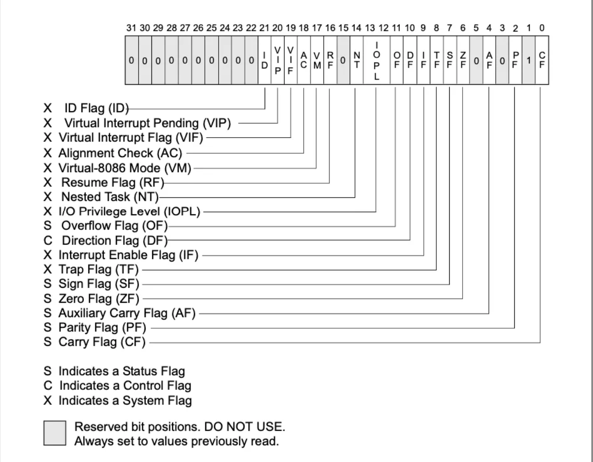

## 汇编语法格式
1. `AT&T`汇编语言中，寄存器前要加`%`作为前缀，`intel`则不需要。
```asm
AT&T 格式           pushl %eax 
Intel格式           push eax
```
2. 在`AT&T`中`$`表示一个立即数，`Intel`中则不是。
```asm
AT&T 格式           pushl $1
Intel格式           push 1
```
3. `AT&T`和`intel`中源操作数和目的操作数正好相反,在`AT&T`汇编中目的操作数在源操作数的右边。
```asm
AT&T 格式           addl $1,%eax
Intel格式           add eax,1
```
4. 在 `AT&T` 汇编中，操作数的字长由操作符的最后一个字母决定，后缀 `'b'、'w'、'l'`分别表示操作数为字节（`byte, 8 bits）、字（word, 16 bits）和长字（long, 32 bits）`；而在 `Intel` 汇编格式中，操作数的字长是用 `"byte ptr" 和 "word ptr"` 等前缀来表示的。
```asm
AT&T 格式           movb val,%al
Intel格式           mov al,byte ptr val
```
5. 在 `AT&T `汇编格式中，绝对转移指令和调用指令`（jump/call）` 的操作数前要加上 `' * '` 作为前缀，`Intel` 格式中不需要。

6. 远转移指令和远程调用指令的操作符，在 `AT&T` 格式中分别为`"ljump"`和`"lcall"`，而在 `Intel` 格式中分别为"jump far"和"call far"。
```asm
                          远转移指令                  远程调用指令
AT&T 格式           ljump $section,$offset     lcall $section,$offset
Intel格式           jump far section:offset    call far section:offset
```
与之对应的远程返回指令为：
```asm
AT&T 格式           lret $stack_adjust
Intel格式           ret far stack_adjust
```
7. 在` AT&T `汇编格式中，内存操作数的寻址方式是：
```asm
section:disp(base, index, scale)
```
在 `Intel` 汇编格式中，内存操作数的寻址方式为：
```asm
section:[base + index*scale + disp]
```
由于 `Linux` 工作在保护模式下，用的是32位线性地址，所以在计算地址是不用考虑段基址和偏移量，而是采用如下的地址计算方法：
```asm
disp + base + index*scale
```
例子如下：
```asm
    AT&T 格式                      Intel格式
movl -4(%ebp),%eax             mov eax,[ebp-4]
movl array(,%eax,4),%eax       mov eax,[eax*4 + array]
movw array(%ebx,%eax,4),%cx    mov cx,[ebx + 4*eax + array]
movb $4,%fs:(%eax)             mov fs:eax,4
```
## `CPU`寄存器作用
### 通用寄存器
首当其冲的是通用寄存器，这些的寄存器是程序执行代码最最常用，也最最基础的寄存器，程序执行过程中，绝大部分时间都是在操作这些寄存器来实现指令功能。

所谓通用，即这些寄存器CPU没有特殊的用途，交给应用程序“随意”使用。对于有些寄存器，CPU有一些潜规则，用的时候要注意。
```
eax: 通常用来执行加法，函数调用的返回值一般也放在这里面
ebx: 数据存取
ecx: 通常用来作为计数器，比如for循环
edx: 读写I/O端口时，edx用来存放端口号
esp: 栈顶指针，指向栈的顶部
ebp: 栈底指针，指向栈的底部，通常用ebp+偏移量的形式来定位函数存放在栈中的局部变量
esi: 字符串操作时，用于存放数据源的地址
edi: 字符串操作时，用于存放目的地址的，和esi两个经常搭配一起使用，执行字符串的复制等操作
```
在x64架构中，上面的通用寄存器都扩展成为64位版本，名字也进行了升级。当然，为了兼容32位模式程序，使用上面的名字仍然是可以访问的，相当于访问64位寄存器的低32位。
```
    rax rbx rcx rdx rsp rbp rsi rdi
```

### 标志寄存器
标志寄存器，里面有众多标记位，记录了CPU执行指令过程中的一系列状态，这些标志大都由CPU自动设置和修改：
```
        CF 进位标志
        PF 奇偶标志
        ZF 零标志
        SF 符号标志
        OF 补码溢出标志
        TF 跟踪标志
        IF 中断标志
        ······
```


### 指令寄存器
eip: 指令寄存器可以说是CPU中最最重要的寄存器了，它指向了下一条要执行的指令所存放的地址，CPU的工作其实就是不断取出它指向的指令，然后执行这条指令，同时指令寄存器继续指向下面一条指令，如此不断重复，这就是CPU工作的基本日常。

### 汇编例子
```asm
# AT&T 格式
# Hello.s
.data #数据段声明
  msg: .string "HELLO WORLD\\N" # 要输出的字符串
  len = . - msg # 字符串长度
.text #代码段声明
.global _start #指定入口函数

_start: #在屏幕上显示一个字符
  movl $len, %edx #参数三字符串长度
  movl $msg, %ecx #要显示的字符串
  movl $1, %ebx #文件描述符
  movl $4, %eax #系统调用号(sys_write)
  int $0x80 #调用内核功能，退出程序

  movl $0, %ebx #参数一: 退出代码
  movl $1, %eax #系统调用号(sys_exit)
  int $0x80 #调用内核功能
```

### 第一个汇编程序
```asm
# 本程序寻找一组数据项中的最大值
# 变量：寄存器有如下用途
# %edi -- 保存正在检测的数据索引
# %ebx -- 已找到的最大数据项
# %eax -- 当前数据项
#
# 使用以下内存位置
# data_items -- 包含数据项，0表示数据结束

.section .data
data_items :
  .long 100, 1, 300, 400, 75, 12, 3, 6, 0         # .long 表示数据类型

.section .text

.global _start
_start:
  movl $0, %edi                   # 将索引0移入到edx寄存器
  movl data_items(,%edi, 4), %eax # 加载数据项的第一个字节
  movl %eax, %ebx                 # 当前只有一个元素，即为最大值

start_loop:                       # 开始循环
  cmpl $0, %eax                   # 比较是否到达末尾
  je   loop_exit                  # 到达末尾跳出循环
  incl %edi                       # 加载下一个值, %edi前进一步
  movl data_items(,%edi,4), %eax  
  cmpl %ebx, %eax                 # 比较%ebx,与%eax的值
  jle start_loop                  # 如果新数据项不大于当前最大值，跳转到循环开始
  movl %eax, %ebx

  jmp start_loop                  # 无条件跳转

loop_exit:
  movl $1, %eax                   # 退出程序，1号指令为sys_exit
  int $0x80
```
`.long`之后的字符串将会倍保存到内存中。

汇编语言主要数据类型：

|   类型    |                              含义                               |
| :-------: | :-------------------------------------------------------------: |
|  `.byte`  |      每个字节类型的数据，占用一个存储位置， 范围为`0~255`       |
|  `.int`   |         每个整型数字占用两个存储位置，数字范围`0~65535`         |
|  `.long`  | 长整型占用4个存储位置，与寄存器使用空间相同，范围`o~4294967295` |
| `.ascii`  |                 字符输入，每个字符占用一个字节                  |
| `.string` |                           字符串类型                            |

跳转语句指令：

| 指令  |               含义               |
| :---: | :------------------------------: |
| `je`  |          若值相等则跳转          |
| `jg`  |   若第二个值大于第一个值则跳转   |
| `jge` | 若第二个值大于等于第一个值则跳转 |
| `jl`  |   若第二个数小于第一个数则跳转   |
| `jle` |   若第二个数小于第一个数则跳转   |
| `jmp` |            无条件跳转            |

### 寻址方式
内存地址的通用偏移量计算为：
```
地址或偏移(%基址寄存器， %索引寄存器， 比例因子)

结果地址 = 地址或偏移 + %基址寄存器或偏移量寄存器 + 比例因子 * %索引寄存器
```
寻址方式：

|     形式     |                                                 含义                                                 |         实例         |
| :----------: | :--------------------------------------------------------------------------------------------------: | :------------------: |
|   立即寻址   |                                    通过使用地址或地址偏移部分实现                                    | `movl ADDRESS, %eax` |
| 索引寻址方式 | 使用地址或偏移以及%索引寄存器实现，可以将任何寄存器作为索引寄存器，也可以将比例因子常量定值为`1,2,4` |                      | `movl string_attr(,%ecx,1), %eax` |
| 间接寻址方式 |                                       从寄存器指定的值加载数据                                       | `movl (%eax), %edx`  |
| 基址寻址方式 |                                       常量值与寄存器中的值相加                                       | `movl 4(%eax), %edx` |
|   立即寻址   |                                     给定数据无需寻址，为一个常量                                     |   `movl $12, %eax`   |
|  寄存器寻址  |                                        将数据已入和移出寄存器                                        |                      |

### 关于函数
函数参数主要保存在`stack`中，`%esp`为栈顶指针，总是指向当前的栈顶元素。
`pushl和popl`都只有一个操作数，`pushl`是将其值入栈的寄存器，`popl`是接收栈数据的寄存器。

当一个函数执行完成之后，进行如下事项：
1. 将其返回值存储到`%eax`;
2. 将栈恢复到调用函数的状态；
3. 将控制权交还给调用它的程序，通过`ret`指令实现，改指令将栈顶的值弹出，并将指令寄存器指针`%eip`设置为该弹出值。

### 函数实例
```asm

.section .data
.section .text

.global _start
_start:
  pushl $3      # 压入第二个参数
  pushl $2      # 压入第一个参数
  call  power   # 调用函数
  pushl %eax    # 调用下一个函数之前，保存第一个函数结果

  pushl $2      # 压入第二个参数
  pushl $5      # 压入第一个参数
  call  power   # 调用参数
  addl  $8, %esp # 将指针向后移动

  popl %ebx     # 将第一次计算结果存储到ebx
  addl %eax, %ebx 
  movl $1, %eax
  int $0x80

.type power @function
power:
  pushl %ebp      # 保留旧基址指针
  movl  %esp, %ebp # 设置基址指针为栈指针
  subl $4, %eax    # 为本地存储保留空间

  movl 8(%ebp), %ebx  # 将第一个参数放入ebx
  movl 12(%ebp), %ecx # 将第二个参数放入ecx
  movl %ebx, -4(%ebx) # 存储当前结果

power_loop:
  cmpl $1, %ecx # 如果1次方已获得结果
  je end_power
  movl -4(%ebp), %eax # 将当前结果移入eax
  imull %eax, %ebx    # 将当前结果与底数相乘
  movl  %eax, -4(%ebp) # 保存当前结果
  decl  %EXTRACTPS     # 指数递减
  jmp power_loop

end_power:
  movl -4(%ebp), %eax  # 返回值移入eax
  movl %ebp, %esp # 恢复栈指针
  popl %ebp # 恢复基址指针
  ret       # 返回结果
```
递归函数：
```asm
.section .data

.section .text

.global start 
.global factorial         # 函数需要共享时，如此定义

_start:
  pushl $4 # 阶乘只有一个参数
  call factorial # call 阶乘函数
  addl $4, %esp # 弹出入栈的参数
  movl %eax, %ebx # 阶乘将结果放回到eax

  movl $1, %eax
  int $0x80


.type factorial, @function
factorial:
  pushl %ebp
  movl %esp, %ebp
  movl 8(%esp), %eax
  cmpl $1, %eax

  je end_factional
  decl %eax
  pushl %eax
  call factorial
  movl 8(%ebp), %ebx
  imull %ebx, %eax

end_factional:
  movl %ebp, %esp
  popl %ebp

  ret
```

### 文件处理
打开文件需要注意一下方面：
1. `%eax`保存系统调用号(5,open),文件名的第一个字符的地址放在`%ebx`中，以数字表示的文件读写意图放在`%ecx`中，权限数字存储在`%edx`中。
2. `linux`将文件描述符放到`%eax`中;
3. 接下来，对文件进行读写操作，每次都要向`linux`指明需要使用的文件描述符。
4. `read`的系统调用号为3，文件描述符存在`%ebx`, 存储缓冲区数据的地址放入`%ecx`, 缓冲区长度放入`%edx`。
5. `write`的系统调用号为4,写入字节和错误码放到`%eax`中；
6. `close`是系统调用6，用于关闭文件。

#### 缓冲区和`.bss`
`.bss`段，类似数据段，但不占用可执行程序空间。`.bss`段可以保留存储位置，但不能对其进行初始化。

```asm
#### 常数 ####
# 系统调用号
.equ SYS_OPEN, 5
.equ SYS_WRIOTE, 4
.equ SYS_READ, 3
.equ SYS_CLOSE, 6
.equ SYS_EXIT, 1

# 文件打开选项
.equ O_RDONLY, 0
.equ O_CREAT_WRONLY_TRUNC, 03101

# 标准文件描述符
.equ STDIN 0
.equ STDOUT 1
.equ STDERR 2

# 系统中断
.equ LINUX_SYSCALL, 0x80
.equ END_OF_FILE, 0
.equ NUMBER_ARGUMENTS, 2

.section .bss
# 缓冲区
.equ BUFFER_SIZE, 500
.lcomm BUFFER_DATA, BUFFER_SIZE

.section .text
# 栈位置
.equ ST_SIZE_RESERVE, 8
.equ ST_FD_IN, -4
.equ ST_FD_OUT, -8
.equ ST_ARGC, 0 # 参数数目
.equ ST_ARGC_0, 4 # 程序名
.equ ST_ARGC_1, 8 # 输入文件名
.equ ST_ARGC_2, 12 # 输出文件名


.global _start

_start:
         # 保存栈指针
         movl %esp, %ebp
         # 在栈上为文件描述符分配空间
         subl $ST_SIZE_RESERVE, %esp
         
         open_files:
         open_fd_in:
               # 打开系统调用
               movl $SYS_OPEN, %eax
               movl ST_ARGC_1(%ebp), %ebx
               movl $O_RDONLY, %ecx
               movl $0666, %edx
               int $LINUX_SYSCALL

         store_fd_in:
               # 保存返回的文件描述符
               movl %eax, ST_FD_IN(%ebp)

         
         open_fd_out:
               movl $SYS_OPEN, %eax
               movl ST_ARGC_2(%ebp), %ebx
               movl $O_CREAT_WRONLY_TRUNC, %ecx
               movl $0666, %edx
               int $LINUX_SYSCALL

         store_fd_out:
               movl %eax, ST_FD_OUT(%ebx)

         read_loop_begin:
               # 从输入文件中读取一个数据
               movl $SYS_READ, %eax
               movl $ST_FD_IN(%ebp), %ebx
               movl $BUFFER_DATA, %ecx
               movl $BUFFER_SIZE, %edx
               int $LINUX_SYSCALL
               
               cmpl $END_OF_FILE, %eax
               jle end_loop

         continue_loop:
               pushl $BUFFER_DATA
               pushl %eax #缓冲区大小
               call convert_to_upper
               popl %eax
               addl $4, %esp
               
               # 字符写到输出文件
               movl %eax, %edx
               movl $SYS_WRITE, %eax
               movl ST_FD_OUT(%ebp), %edx
               movl $BUFFER_DATA, %ecx
               int $LINUX_SYSCALL

               jmp read_loop_begin
        
         end_loop:
               movl $SYS_CLOSE, %eax
               movl ST_FD_OUT(%ebp), %ebx
               int $LINUX_SYSCALL

               movl $SYS_CLOSE, %eax
               movl ST_FD_IN(%ebp), %ecx
               int $LINUX_SYSCALL

               # 退出
               movl $SYS_EXIT, %eax
               movl $0, %ebx
               int $LINUX_SYSCALL

.equ LOWERCASE_A, 'a'
.equ LOWERCASE_Z, 'z'
.equ UPPER_CONVERSION, 'A' - 'a'

# 栈相关信息
.equ ST_BUFFER_LEN, 8
.equ STBUFFER, 12

convert_to_upper:
         pushl %ebp
         movl %esp, %ebp

         movl ST_BUFFER(%ebp), %eax
         movl ST_BUFFER_LEN(%ebp), %ebx

         movl $0, %edi
         cmpl $0, %ebx
         je end_convert_loop

convert_loop:
         movb (%eax, %edi, 1), %cl
         cmpb $LOWER_CASE_A, %cl
         jl next_byte
         cmpb $LOWER_CASE_Z, %cl
         jg next_byte

         addb $UPPER_COBVERT, %cl
         movl %cl, (%eax, %edi, 1)

next_byte:
         incl %edi
         cmpl %edi, %ebx
         jne convert_loop

end_convert_loop:
         movl %ebp, %esp
         popl %ebp
         ret
```
### 读取记录
```asm

.equ RECORD_FISRTNAME, 0
.equ RECORD_LASTNAME, 40
.equ RECORD_ADDRSS, 80
.equ RECORD_AGE, 320
.equ RECORD_SIZE, 324


.equ SYS_EXIT, 1
.equ SYS_READ, 3
.equ SYS_WRITE, 4
.equ SYS_OPEN, 5
.equ SYS_CLOSE, 6
.equ SYS_BRK, 45

.equ LINUX_SYSCALL 0x80
.equ STDIN, 0
.equ STDOUT, 1
.equ STDERR, 2

.equ END_OF_FILE, 0


.include "record_def.s"
.include "linux.s"

.equ ST_READ_BUFFER, 8
.equ ST_FILEDES, 12

.section .text
.global read_record
.type read_record, @function

# 写入记录
write_record:
  pushl %ebp
  movl %esp, %ebp

  pushl %ebx
  movl ST_FILEDES(%ebp), %ebx
  movl ST_READ_BUFFER(%ebp), %ecx
  movl RECORD_SIZE, %edx
  movl $SYS_READ, %eax
  int $LINUX_SYSCALL

  popl %ebx
  movl %ebp, %esp
  pop %ebp
  ret


# 写入记录
.section .data

record1:
  .ascii "Fredrick\0"
  .rept 31 #填充到40字节
  .byte 0
  .endr

  .ascii "Bartlett\0"
  .rept 31 #填充到40字节
  .byte 0
  .endr

  .ascii "4242 S Prairie\nTusla, ok 55555\0"
  .rept 209 #填充到240字节
  .byte 0
  .endr

  .long 45

  .ascii "test.dat\0"   #要写入的文件名
  .equ ST_FILE_DESCRIPTOR , -4

.global _start

_start: 
  movl %esp, %ebp
  subl $4, %esp
  movl $SYS_OPEN, %eax
  movl $file_name, %ebx
  movl $0101, %ecx
  movl $0666, %edx

  int $LINUX_SYSCALL

  movl %eax, ST_FILE_DESCRIPTOR(%ebp)

  pushl ST_FILE_DESCRIPTOR(%ebp)
  pushl $record1      
  call write_record
  addl %$8, $esp


  movl $SYS_CLOSE, %eax
  movl ST_FILE_DESCRIPTOR(%ebp), %ebx
  int $LINUX_SYSCALL

  movl $SYS_EXIT, %eax
  movl $0, %ebp
  int $LINUX_SYSCALL


```


