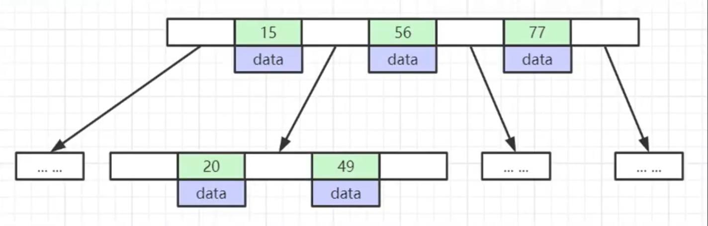
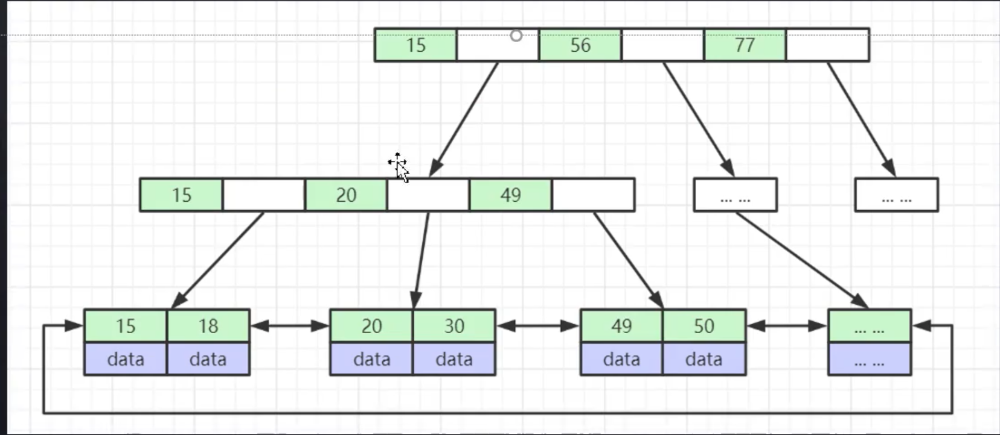
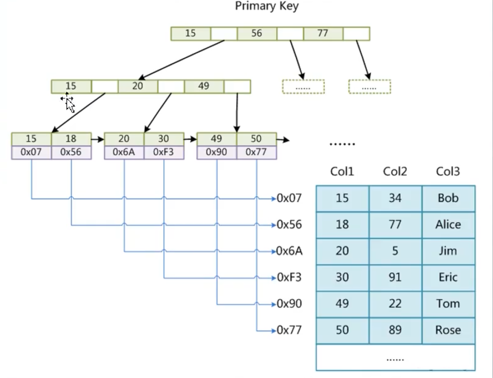
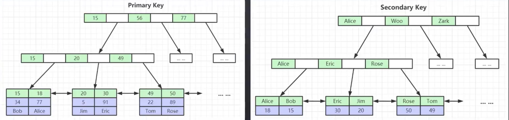
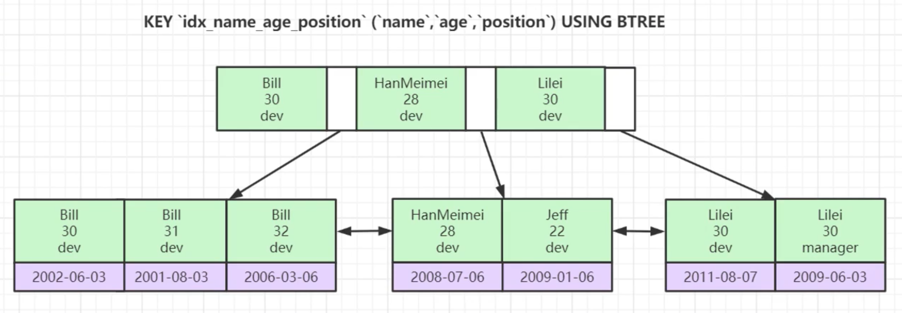
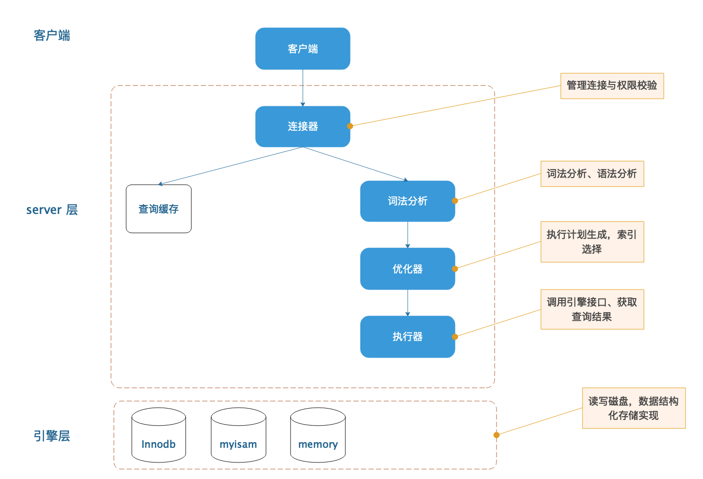
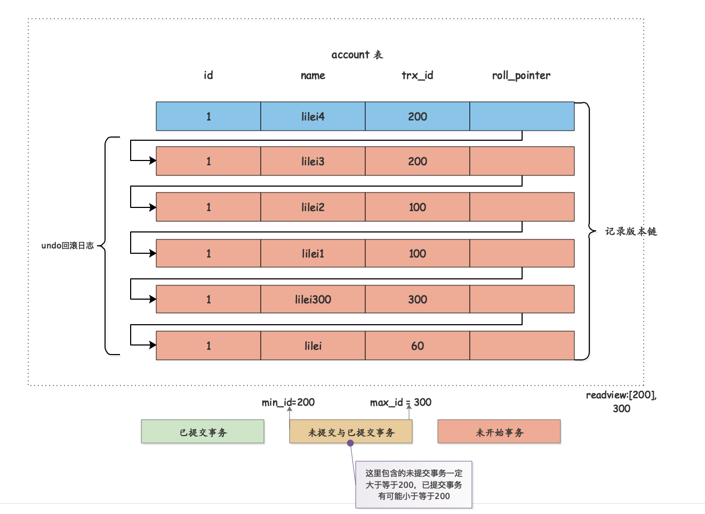
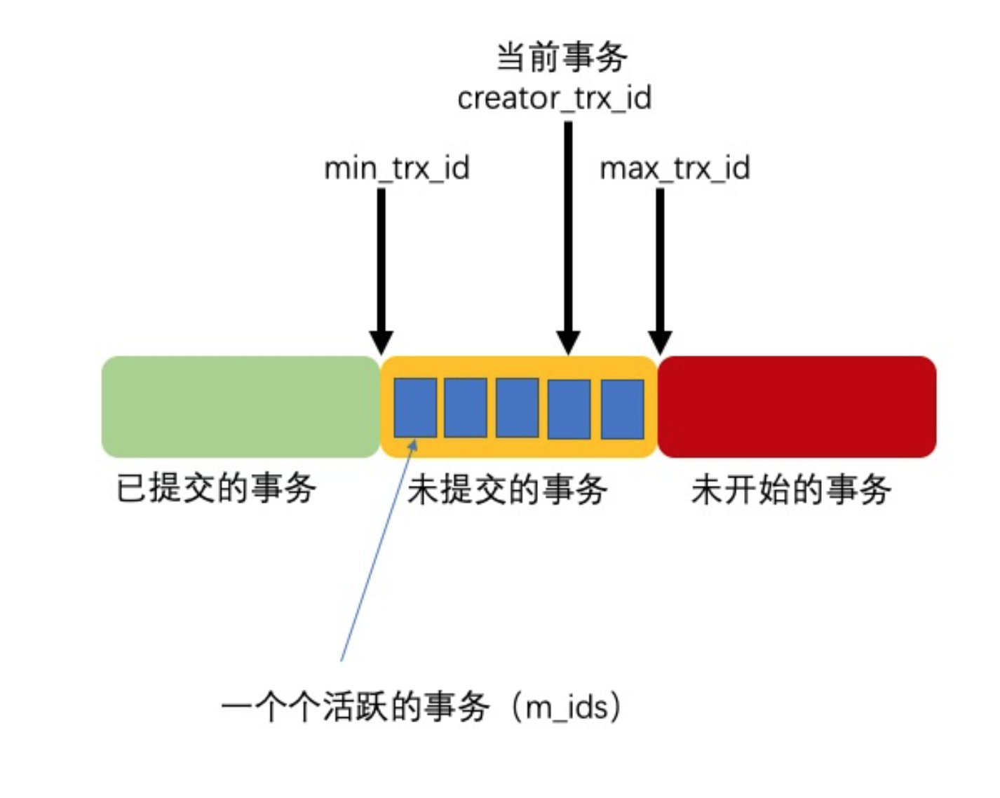
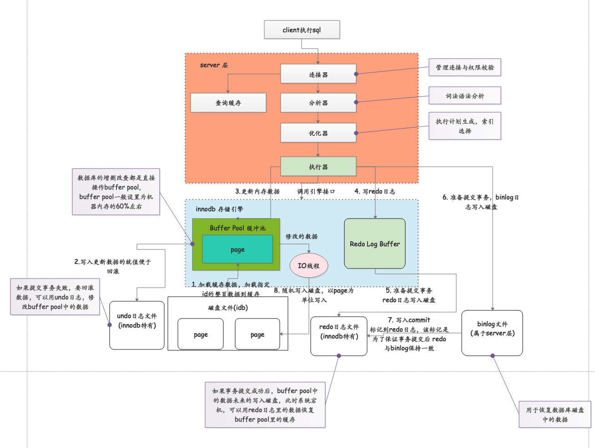
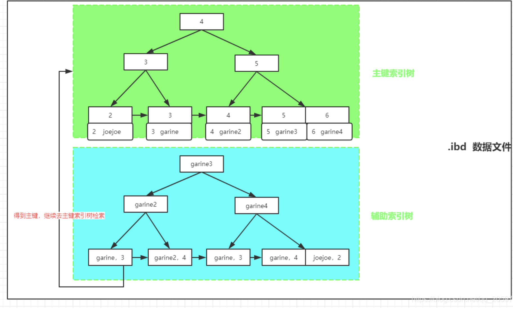

# `MYSQL`基础知识
## 索引
帮助`MYSQL`高效获取数据的排好序的数据结构。
索引的数据结构：
* 二叉树
* 红黑树
* `Hash`表
* `B-Tree`

`B Tree`:
1. 叶子节点具有相同深度，叶节点指针为空；
2. 所有索引元素不重复；
3. 节点中的数据索引从左到右递增排序。




`B+ Tree`:
1. 非叶子结点不存储`data`,只存储索引冗余，可以存放更多的数据；
2. 叶子结点包含索引段；
3. 叶子结点用指针连接，提高区间访问性能。



`MyISAM`索引文件和数据文件是分离的。

`InnoDB`索引实现：
1. 表数据文件本身是按照`B+Tree`组织的一个索引结构；
2. 聚集索引-叶节点包含了完整的数据记录；
3. 为什么`Innodb`表必须建主键，并且推荐使用整型自增主键？
4. 为什么非主键索引结构存储的是主键的值？(一致性和节省空间)

使用整型字符串，方便数据比较。不建议使用字符串。同时有利于节约磁盘空间。


`Hash`索引：
1. 对索引的`key`进行一次计算就能得到数据存储位置；
2. 很多时候`hash`索引要比`btree`索引更加高效；
3. 仅能满足`=`, `IN`查询，不支持范围查询；
4. `hash`冲突问题。

### 索引的最左前缀原则
联合索引的数据结构是什么？

从左向右匹配，当第一个与索引不匹配时，索引失效。
因为联合索引按照，从左到右的索引顺序排序。即：
1. 第一列排序，在第一列排序的结构中，第二列排序，在第一列与第二列排序的结果中，对第三列排序，后续依次排序。

所以对如下索引：
``` sql
KEY `idx_name_age_position` (`name`,`age`,`position`) USING BTREE
```
有如下查询：
1. `EXPLAIN SELECT * FROM employees WHERE name='Bill' and age = 31`
2. `EXPLAIN SELECT * FROM employees WHERE age=30 and position = 'dev'`
3. `EXPLAIN SELECT * FROM employees WHERE position = 'dev' `
4. `EXPLAIN SELECT * FROM employees WHERE name='Bill' and position = 'dev'`

通过上述分析，能够使用到索引的查询有：`1，4.`
对`4`仅使用了部分最左索引`name`部分。

**索引总结：**
> 假设存在索引`index(a,b,c)`:

|                        `where`子句                         |                 索引是否被使用                  |
| :--------------------------------------------------------: | :---------------------------------------------: |
|                       `where a = 3`                        |                  使用了索引`a`                  |
|                  `where a = 3 and b = 5`                   |               使用了索引`a`和`b`                |
|             `where a = 3 and b = 5 and c = 4`              |               使用了索引`a、b、c`               |
|                  `where a = 3 and c = 4`                   |    使用了索引`a`,但`c`不可以，因为`b`被中断     |
| `where c = 4` 或 `where b = 5`  或 `where b = 5 and c = 4` |            不使用索引,因为`a`被中断             |
|             `where a = 3 and b > 5 and c = 4`              | 使用了`a,b`，不使用`c`，因为`c`不能用在范围之后 |
|          `where a = 3 and b like 'kk%' and c = 4`          |                 使用索引`a,b,c`                 |
|          `where a = 3 and b like '%kk' and c = 4`          |                   使用索引`a`                   |
|         `where a = 3 and b like '%kk%' and c = 4`          |                   使用索引`a`                   |
|         `where a = 3 and b like 'k%kk%' and c = 4`         |                 使用索引`a,b,c`                 |
|                `where a = 3 and b is null`                 |                   不使用索引                    |

**`like kk%` 相当于常量， `%kk和%kk%`相当于范围.**

### 索引的最佳实践
1. 全值匹配
2. 最左前缀法则
3. 不在索引列上做任何操作(计算，函数，(自动或手动)类型转换)，会导致索引失效转而全表扫描
4. 存储引擎不能使用索引中范围条件右边的列
5. 尽量使用覆盖索引(只访问索引的查询)，避免`select *`的情况
6. `mysql`在使用`!=`或`<>`时无法使用索引会导致全表扫描
7. `is null, is not null`一般情况下无法使用索引
8. `like`以通配符开头，无法使用索引表位全表扫描
9. 字符串不加单引号索引失效
10. 少用`or或in`，不一定会使用索引
11. 范围查询优化

### `EXPLAIN`
1. `select_type` 对应的列是简单的还是复杂的查询。
> * `simple:`简单查询，查询不包括子查询和`union`；
> * `primary:` 复杂查询中的最外层的`select`;
> * `subquery:` 包含在`select`中的子查询,(不含`from`子句);
> * `derived:` 包含在`from`子句中的子查询。`mysql`通常将结构放到一个临时表中，也称为派生表.
> * `union:` 在`union`中的第二个和随后的`select`。
2. `table`列
   表示`explain`一行正在访问哪个表。
   当有`from`子查询的时候，`table`列为`<derivenN>`的格式，表示当前查询依赖`id=N`的查询；
   当有`union`时，`UNION RESULT`的`table`列的值为`<union 1,2>`, `1和2`表示`union`的`select的id列`.
3. `type`列
   这一列表示关联类型或表示类型，即`MYSQL`决定如何查找表中的行，查找数据行记录的大概范围。
   依次从最优到最差分别为: `system > const > eq_ef > ref > range > index > ALL`
   一般来说：**能保证到达`range`级别最好到达`ref`。**
   `NULL:` `mysql`在优化阶段分解`sql`语句，在执行阶段不用再访问表或索引。如：在索引列中查找最小值，不用在执行时访问表。
   `const,system`：对查询的某部分进行优化转为一个常量，用于`primary key`或`unique key`的所有列与常数比较时，所以表最多有一行匹配，读取`1`次，速度较快。`system是const的特例`，表里只有一个元组匹配时为`system`。
   `eq_ref`: `primary key`或`unique key`索引的所有部分被连接使用，最多只会返回一条符合条件的记录。
   `ref`: 不使用唯一索引，而是使用不同索引或者唯一性索引的部分前缀，索引要和某个值比较，可能会找到多个符合条件的行。
     * 简单的`select`查询，用到非唯一索引;
     * 关联表查询；
  
   `range:` 范围扫描，通常出现`in(), between, <,>,>=`等操作，使用一个索引来检索给定范围。
  `index`: 扫描全索引就可以拿到结果，一般是扫描二级索引，这种扫描不会从索引树根节点开始扫描，而是直接对二级的叶子结点进行扫描和遍历，一般为使用覆盖索引，二级索引比较小，所以比`ALL`快。
  `all`: 全表扫描，扫描聚簇索引的所有叶子结点，通常情况需要增加索引优化。

4. `possible_keys`列
   显示可能使用哪些索引来查找。
   为`NULL`时表示库中数据不多，不建议使用索引。
5. `key`列
   显示`mysql`使用哪个索引对查询进行了优化。
   如果没有使用索引，该列为`NULL`。如果想强制`mysql`使用或忽视`possible_keys`中的列在查询中使用`force index`或`ignore index`;
6. `key_len`列
   显示索引使用的字节数，通过这一列可以算出使用了索引的哪些列。
   计算规则如下：
   * 字符串
     * `char(n)`: `n`字节长度
     * `vchar(n)`: 如果为`utf-8`长度为`3n+2`,增加两个字节存储字符串长度
   * 数值类型：
     * `tinyint`: `1`字节
     * `smallint`: `2`字节
     * `int`: `4`字节
     * `bigint`: `8`字节
   * 时间类型：
     * `date`: `3`字节
     * `timestamp`: `4`字节
     * `datetime`: `8`字节
   * 如果字段允许为`NULL`, 则需要`1`字节记录是否为`NULL`。

索引的最大长度为`768`字节，当字符串过长时，提取前半部分作为索引。

7. `ref`列
   `key`列记录索引中，表查值所用到的列或常量。
8. `rows`列
   `mysql`要读取和检测的行数，非结果集的行数。
9. `Extra`列
    * `Using index`: 使用覆盖索引。`select`后面的查询字段可以从索引树中提取。
    * `using where`: 使用`where`子句来处理结果，并且查询的列未被索引覆盖。
    * `using index condition`: 查询的列不完全被索引覆盖，`where`条件中是一个前导列范围。
    * `using temporary`: 创建临时表处理查询。

## `SQL`执行过程


## 索引优化
优化总结：
1. `MYSQL`支持两种方式的排序(`filtersort和index`)，`Using index`是指`MYSQL`扫描索引本身完成排序，`filtersort`效率低，`index`效率高。
2. `order by` 满足两种情况会使用`using index`:
   * `order by`子句使用索引最左前列
   * 使用`where`子句和`order by`子句条件列组合满足最左前列

3. 尽量使用索引列上完成排序，遵循索引建立时最左前缀法则
4. 如果`order by`不在索引列，将发生`using filtersort`
5. 能用覆盖索引，尽量使用覆盖索引
6. `group by`与`order by`类似如果不需要排序，可以加上`order by null`禁止排序。

`using filtersort`文件排序原理：
* 单路排序： 一次性取出满足条件行的全部字段，然后在`sort buffer`中排序，用`trace`工具可以看到`sort mode`信息里显示的`<sort_key, additional_fileds>`或`<sort_key, packed_additional_fileds>`
* 双路排序：取出满足条件的`sortkey`和直接定位行数据的行`ID`，在`sort buffer`中进行排序，拍完序后再取回其他需要字段。用`trace`工具可以看到`sort mode`信息里显示的`<sort_key, rowid>`

`MYSQL`通过比较系统变量`max_length_for_sort_data(默认1024字节)`，和需要使用查询的字段总大小来判断使用哪种模式：
1. 小于使用单路排序；
2. 大于使用双路排序。

### 事务隔离级别与锁机制
#### 事务及其`ACID`属性
事务是由一组`sql`组成的逻辑单元，事务具有以下`4`个属性，通常成为事务的`ACID`属性：
* 原子性(`Atomicity`): 原子操作，对数据的修改要么全部执行，要么全部不执行；
* 一致性(`Consistent`)：在事务的开始和完成时必须保持一致状态，这要求所有相关的数据规则必须应用于事务修改，以保持数据的完整性；
* 隔离性(`Isolation`)：数据库系统具有一定的隔离机制，保证事务在不受外部影响的独立环境中执行，事务执行的中间状态不可见；
* 持久性(`Durable`)：数据完成后，对事务的修改是永久性的，即使出现故障也能保持。

并发事务处理带来的问题：
> **更新丢失(`Lost Update`)或脏读**
> 当两个或多个事务选择同一行，然后基于最初选定的行更新该值时，由于当前事务不知道其他事务的存在，就造成了**最后的更新覆盖了其他事务所做的更新.**
> **脏读(`Dirty Reads`)**
> 一个事务正在修改一条记录，在这个事务完成前并提交，这条数据就处于不一致状态。如果此时另一个事务来读取同一条数据，如果不加控制，第二条数据读取了脏数据，并以此作进一步处理，产生依赖于未提交的数据的关系，就叫脏读。
> 即**事务A读取了事务B已提交但尚未修改的数据，还在此基础上做了操作。如果事务B回滚，事务A读取的数据无效，不符合一致性的要求。**
> **不可重复读(`Non-Repeatable Reads`)**
> 一个事务在读取了某些数据的某个时间后，再次读取这些数据发现数据已经被修改，或删除。
> 即**事务A相同的查询语句，在不同的时刻读出来的结果不一致，不符合隔离性。**
> 幻读(`Phanthom Reads`)
> 一个事务按相同的查询条件重新读取以前检索过的数据，却发现其他事务插入了满足其查询条件的新数据。
> 即**事务A读取了事务B新增的数据，不符合隔离性。**

### 事务的隔离级别

|           隔离级别           | 脏读(`Dirty Read`) | 不可重复读(`Non-Repeatable Read`) | 幻读(`phanthom Reads`) |
| :--------------------------: | :----------------: | :-------------------------------: | :--------------------: |
| 读未提交(`Read Uncommitted`) |        可能        |               可能                |          可能          |
|  读已提交(`Read Committed`)  |       不可能       |               可能                |          可能          |
| 可重复读(`Repeatable Read`)  |       不可能       |              不可能               |          可能          |
|   可串行化(`Serializable`)   |       不可能       |              不可能               |         不可能         |

### 锁详解
1. 分类
   * 从性能上分，**乐观锁与悲观锁.**
   * 对数据库操作类型分**读锁和写锁(都是悲观锁)**
     * **读锁(共享锁，S锁(Shared))**: 针对读操作，多个事务可以并发
     * **写锁(排它锁，X锁(eXclusive))**: 当前写操作没完成之前，阻断其他写锁与读锁
   * 从数据操作粒度分：**表锁与行锁**

2. 表锁
   锁定整张表。开销小，加锁快，不会出现死锁，锁定粒度大，发生锁冲突的概率最高，并发度最低，一般用在整表数据迁移的场景。
   增加表锁：
   ```sql
      lock table 表名称 read(write), ...; -- 加表锁
      show open tables; -- 查看表加过的锁
      unlock tables; -- 删除表锁
   ```
3. 行锁
   每次操作锁住一行数据，开销大，加锁慢，会出现死锁；锁的粒度小，发生锁冲突的概率最低，并发度最大。
   `Innodb与Myisam`最大的区别：
   > * `Innodb`支持事务(`TRANSACTION`)
   > * `Innodb`支持行锁

总结：
**`MyIsam`在执行`select`之前，会自动给涉及的所有表加读锁，`update, insert, delete`操作会自动给涉及的表加写锁.**
**`InnoDB`在查询`select`因为`MVCC`机制不加锁，update, insert, delete`之前给指定的行加行锁.**

### 间隙锁(`Gap Lock`)
锁的两个值之间有空值，`Mysql`默认级别为`repeatable-read`,间隙锁可以在某些情况下解决幻读问题。
例如对`(3,10),(10,20),(20, +∞)`添加了间隙锁，则无法在`(3,20]`这个范围内所包含的所有行为记录以及行为记录所包含的间隙里插入和修改任何数据。
**间隙锁仅在可重复读隔离级别生效.**
### 临键锁(`Next-key Lock`)
行锁与间隙锁的组合。

**无索引行锁会升级为表锁**
> 锁主要加载索引上，对非索引字段的更新行锁有可能变成表锁。

总结：
`Innodb`实现了行级锁定，提高了系统的整体并发性。
但如果使用不当，会使得`Innodb`的整体性能不如`myisam`。

### 行锁分析
检查`Innodb_row_lock`状态变量，来分析系统上行锁的竞争情况。
```sql
show status like 'innodb_row_lock%';
```
对状态变量说明：
|              `val`              |                   描述                   |
| :-----------------------------: | :--------------------------------------: |
| `Innodb_row_lock_current_waits` |           当前正在等待锁的数量           |
|     `Innodb_row_lock_time`      |      从系统启动到现在锁定总时间长度      |
|   `Innodb_row_lock_time_avg`    |          每次等待所花的平均时间          |
|   `Innodb_row_lock_time_max`    | 从系统启动到现在等待最长的一次所花的时间 |
|     `Innodb_row_lock_waits`     |        系统启动到现在总等待的次数        |

### 查看事务锁
```sql
select * from INFORMATION_SCHEMA.INNODB_TRX; -- 查看事务
select * from INFORMATION_SCHEMA.INNODB_LOCKS; -- 查看锁
select * from INFORMATION_SCHEMA.INNODB_LOCK_WAITS; --查看锁等待
kill $try_mysql_thread_id; -- 释放锁 try mysql thread id 可以从INNODB_TRX表中看到
```

### 锁优化建议
1. 所有数据检索都通过索引来完成，避免无索引行锁升级为表锁；
2. 合理设计索引，尽量缩小锁的范围；
3. 尽可能减少检索条件范围，避免间隙锁；
4. 尽量控制事务大小，减少锁定资源量和时间长度，涉及事务加锁的`sql`尽量放到事务最后进行；
5. 尽可能低级别事务隔离。

## `MVCC`多版本并发控制
在可重复读的模式下，保证事务较高的隔离性。
在`MVCC模式下，对一行数据的读写两个操作不会通过加锁互斥来保证隔离性，避免了频繁加锁互斥。可串行化的为保证较高的隔离级别是通过操作加锁互斥来实现的。
### `undo`日志版本链接和`read view`机制详解
`undo`日志版本链是指一行数据被多个事务修改后，在每个事务修改完成后，`mysql`会保留修改前的数据`undo`日志，并且用两个隐藏字段`trx_id`和`roll_pointer`把这些`undo`日志串联起来形成一个历史记录版本链。


在**可重复度隔离级别**，当事务开启，执行任何查询`sql`时会生成当前事务的**一致性视图(`read-view`)**, 该视图在事务结束前都不会变化(**如果是读已提交格列级别在每次查询`SQL`时都会重新生成。**),这个视图由查询时所有未提交事务`id`数组(数组最小的`id`为`min_id`)和已创建的最大事务`id`(`maxid`)构成，事务里的任何`sql`查询结果需要从对应版本链的最新数据开始逐条跟`read_view`做对比从而得到最终的快照结果。

**`begin/start transaction`命令并不是一个事务的起点，在执行到他们之后的第一个修改操作的`InnoDB`表的语句，事务才真的启动，才会向`mysql`申请事务`id`，`mysql`内部严格按照事务顺序分配事务`id`。**

`ReadView`所解决的问题是使用`READ COMMITTED和REPEATABLE READ`隔离级别的事务中，不能读到未提交的记录，这需要判断一下版本链中的哪个版本是当前事务可见的。
`ReadView`中主要包含4个比较重要的内容：

   * `m_ids：`表示在生成`ReadView`时当前系统中活跃的读写事务的`事务id`列表。
   * `min_trx_id：`表示在生成`ReadView`时当前系统中活跃的读写事务中最小的事务`id`，也就是`m_ids`中的最小值。
   * `max_trx_id：`表示生成`ReadView`时系统中应该分配给下一个事务的`id`值。
   * `creator_trx_id：`表示生成该`ReadView`的事务的事务`id`。



**版本链对比规则：**
有了这些信息，这样在访问某条记录时，只需要按照下边的步骤判断记录的某个版本是否可见：
   * 如果被访问版本的`trx_id`属性值与`ReadView中的creator_trx_id`值相同，意味着当前事务在访问它自己修改过的记录，所以该版本可以被当前事务访问。
   * 如果被访问版本的`trx_id`属性值小于`ReadView中的min_trx_id`值，表明生成该版本的事务在当前事务生成`ReadView`前已经提交，所以该版本可以被当前事务访问。
   * 如果被访问版本的`trx_id`属性值大于`ReadView中的max_trx_id`值，表明生成该版本的事务在当前事务生成`ReadView`后才开启，所以该版本不可以被当前事务访问。
   * 如果被访问版本的`trx_id`属性值在`ReadView的min_trx_id和max_trx_id`之间，那就需要判断一下`trx_id`属性值是不是在`m_ids`列表中，如果在，说明创建`ReadView`时生成该版本的事务还是活跃的，该版本不可以被访问；如果不在，说明创建`ReadView`时生成该版本的事务已经被提交，该版本可以被访问。


**从架构可以看出，`MYSQL`写回数据是以`page`为单位的，在`mysql`中，每个`page`大小为`16K`。**

`Mysql InnoDB`为解决`幻读`主要采用了：
1. `MVCC`机制，主要用来解决快照读的幻读；
2. `Gap LOCK`, 解决部分幻读；
3. `Nextkey Lock`: 解决整体的幻读，行锁+gap lock 实现。

### `GAP LOCK` 
保证在`for update`的情况下，不会出现幻读。
`gap lock`加锁机制：

1. `for update`下合适加锁规则：
   * 唯一索引
     * 精确等值检索，`NextKey Lock`退化为行锁，不会加`gap lock`;
     * 范围检索，锁定`where`条件中的相应范围，范围中的记录，间隙；记录锁加行锁；
     * 不走索引检索，全表gap加gap锁，全表记录加记录锁；
   * 非唯一索引
     * 精确等值检索，`Next key Lock`对间隙加`gap lock`，对检索到的记录加记录锁；
     * 范围检索，锁定`where`条件中的相应范围，范围中的记录，间隙；记录锁加行锁；
   * 非索引检索，全表gap加gap锁，全表记录加记录锁。

2. 加锁规则
   * 加锁的基本规则是`next-key lock`,前开后闭。
   * 查找的过程中，访问到的对象才会加锁；
   * 索引上的等值查询，给唯一索引加锁的时候，`next key lock`退化为行锁；
   * 索引上的等值查询，向右遍历时且最后一个值不满足等值条件时，`next key lock`退化为间隙锁；
   * 唯一索引上的范围查询会访问到第一个不满足条件的值为止。

`gap lock`加锁原则：
索引的数据结构如下：


`gap lock`是锁定索引树叶子节点之间的空隙，不让新的记录插入到间隙。

```sql
CREATE TABLE `test` ( 
`id` int(11) primary key auto_increment, 
`xid` int, KEY `xid` (`xid`) ) 
ENGINE=InnoDB DEFAULT CHARSET=utf8; 
insert into test(xid) values (1), (3), (5), (8), (11);
```
这里xid上是有索引的，因为该算法总是会去锁住索引记录。
现在，该索引可能被锁住的范围如下：
(-∞, 1], (1, 3], (3, 5], (5, 8], (8, 11], (11, +∞)
根据下面的方式开启事务执行SQL：

Session A执行后会锁住的范围：(5, 8], (8, 11]除了锁住8所在的范围，还会锁住下一个范围，所谓Next-Key。这样，Session B执行到第六步会阻塞，跳过第六步不执行，第七步也会阻塞，但是并不阻塞第八步，第九步也不阻塞。上面的结果似乎并不符合预期，因为11这个值看起来就是在(8, 11]区间里，而5这个值并不在(5, 8]这个区间里。

该SQL语句锁定的范围是（5,8]，下个键值范围是（8,11]，所以插入5~11之间的值的时候都会被锁定，要求等待。即：插入5，6，7，8，9，10 会被锁住。插入非这个范围内的值都正常。

