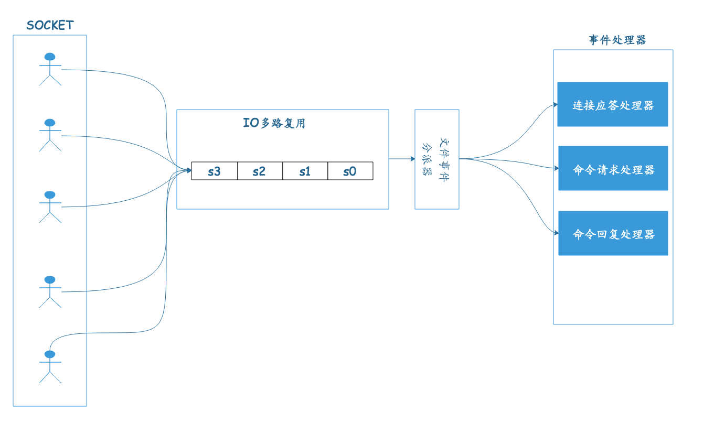
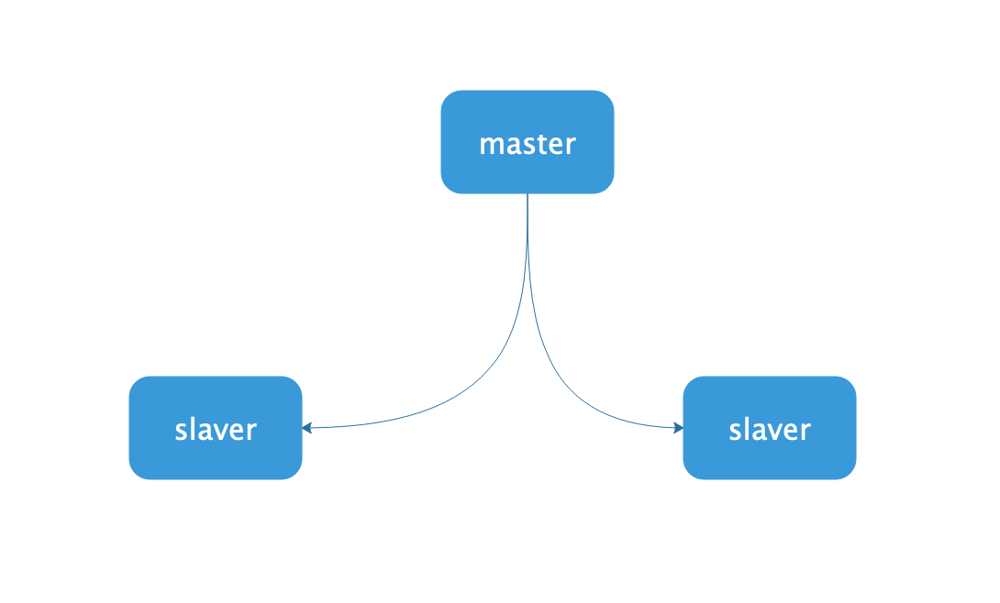
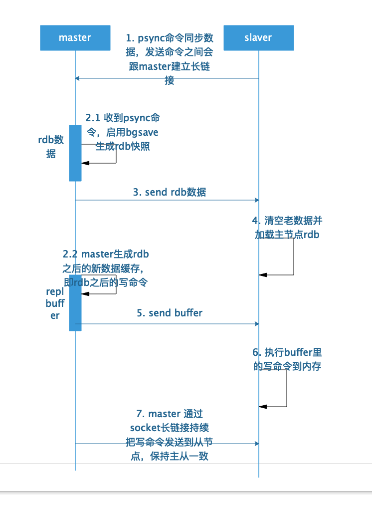
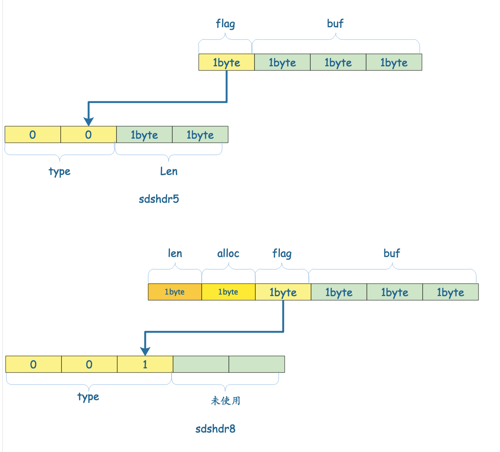

## `REDIS`
### `Redis`单线程与高性能
`Redis`单线程是指`Redis`的网络`IO`和键值对读写是由一个线程来完成的，这也是`redis`对外提供键值服务的一个重要流程。但`redis`的其他功能，如持久化、异步删除、集群数据同步等，其实是由额外的线程执行的。

单线程性能问题：
因为其所有数据都在内存中，所有的运算都是内存级别的运算，而单线程避免了多线程的切换性能损耗。

并发客户端连接：
`IO`多路复用：利用`epoll`实现`IO`多路复用，将连接信息和事件放入队列中，依次放到文件事件分派器，事件分派器将分发给事件处理器。

### `redis`持久化
#### `RDB`快照(`snapshot`)
默认情况下，`redis`将内存数据库快照保存在`dump.rdb`文件中。
可以设置为：`N秒内收集直到M个改动这一条件满足时，自动保存一次数据集`.
还可以手动执行`save`和`bgsave`可以生成`dump.rdb`文件，默认覆盖已有的文件。

`bgsave`的写时(`cow`)复制机制
`redis`借助操作系统提供的写时复制技术，在生成快照的同时，依然可以正常处理写命令。
`bgsave`子进程由主进程`fork`生成，可以共享主线程的所有内存数据。`bgsave`子进程运行后，开始读取主线程内存数据，并把他们写入`RDB`文件。此时如果主线程对这些数据读，主进程与子进程之间互不影响。如果主进程修改这些数据，就会生成数据的副本，子进程将数据副本写入`RDB`文件中，而这个过程中，主线程仍可以修改原来的数据。

### `AOF(`append-only file`)`
快照功能并不耐久(`durable`): 如果`redis`因为某些原因造成了故障死机，那么服务器将丢失最近写入，且仍未保存到快照中的那些数据。
`AOF`文件重写，`redis`定时重写`AOF`文件。

`Redis`主从架构：

### `redis`哨兵高可用架构
`sentinel`哨兵是特殊的`redis`服务，不提供读写服务，主要用来监控`redis`实例节点。
哨兵架构下`redis`端第一次从哨兵找出`redis master`，不会每次都通过`sentinel`代理访问`redis master`, 当`redis`主节点发生变化，哨兵会第一时间感知到，并将新的`redis master`通知`client`。

多采用一致性hash的方式，实现高可用集群。
### `redis`集群通信机制
`redis cluster`之间采用`gossip`协议通信。
* 维护集群的元数据(集群节点信息、主从角色、节点数量、各节点共享的数据等)两种方式(集中式和`gossip`)。

集中式：
优点：元数据的更新和读取，时效性非常好。一旦元数据变化会立即更新到集中式存储中，其他节点读取的时候就能立刻感知到。
缺点： 元数据存储集中，导致元数据存储的压力。

`gossip`包含多种协议：
`meet`: 某个节点发送`MEET`给新加入的节点，然后新节点就会与其他节点进行通信；
`ping`: 每个节点都会频繁给其他节点发送`ping`，包含自己的状态还有自己维护的元数据集群，互相通过`ping`来交换数据；
`pong`: `meet和ping`消息的返回，包含自己的状态和其他信息，也可以用于信息广播和更新;
`fail`: 某个节点判断另一个节点`fail`之后，就发送`fail`给其他节点，通知其他节点，指定节点宕机。

优点：元数据保存分散，不集中在一个地方；
缺点：元数据更新有一定的延迟。

网络抖动：
只有在某个节点持续`timeout`时，才会被任务服务宕机。
集群选举：
1. `slave`发现自己的`master`变为`FAIL`
2. 将自己记录的集群`currentEpoch`加`1`, 并广播`FAILOVER_AUTH_REQUEST`信息；
3. 其他节点收到该信息，只有`master`节点响应，判断请求者的合法性，并发送`FAILOVER_AUTH_ACK`, 每个`epoch`只发送一次`ack`；
4. 尝试`failover`的`slaver`收集`FAILURE_AUTH_ACK`
5. `slave`收到半数`master`的`ack`后变为新的`master`
6. `slaver`广播`Pong`信息通知其他节点

从节点并不是在主节点一进入`FAIL`状态立刻发起选举，而是有一定的延迟，延迟的作用是保证`FAIL`在集群中传播。
延迟计算公式：
$$ DELAY = 500ms+random(0,500)ms+SLAVERANK * 1000ms $$
`SLAVERANK`表示此`slave`从`master`复制的总量的`rank`。
`rank`越小表示持有的数据越新。这个公式下持有最新的`rank`的节点总是最先发起选举。

### `redis`设计
#### `SDS`

渐进式`hash`:
当存储数据变得越来越大，进行`rehash`, 容量增加一倍。
步骤：
1. 当访问原数据中的key时，自动将该数据搬到新的空间中，
2. 当无数据访问时，自动将老数据放到新的空间中，
3. 插入新的数据时，直接插入新的空间中。

### `redis`高可用架构
1. 缓存雪崩
   缓存层支撑不住或宕机后，流量直接达到后端存储层。
预防和解决缓存问题从以下一个方面入手：
  * 保证缓存层服务高可用性；
  * 依赖隔离组件为后端限流熔断并降级；
  * 提前预案。

2. 数据库与缓存双写不一致
   * 主要通过设置过期时间，每隔一段时间更新一次缓存。
   * 如果要求强不执行，需要通过加锁来实现缓存与数据库的一致性保证。
   * 通过监听`mysql`的`binlog`及时的去修改缓存。

  

