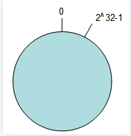
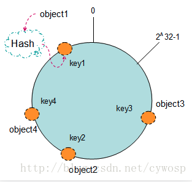
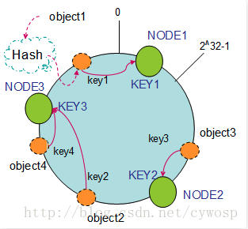
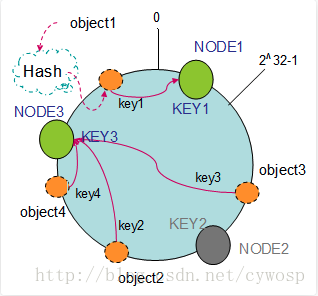
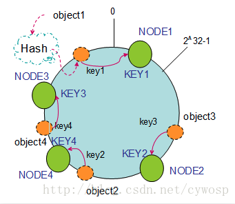
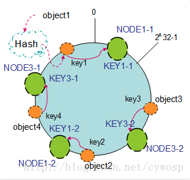
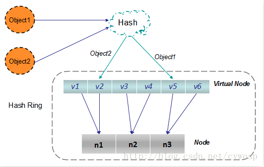

# 一致性hash
## 简介
一致性哈希算法是在1997年由麻省理工提出的一种分布式哈希(`DHT`)算法,其设计目的是为了解决因特网中的热点(`Hot spot`)问题，初衷与`CARP`十分类似。
以如下传统`hash`说明：
> 假定`N`为后台服务节点数，当前台携带关键字`key`发起请求时，我们通常将`key`进行`hash`后采用模运算($hash(key)%N$)将请求分发到不同的节点上；
> 对前台请求于后台无状态服务节点不敏感的场景而言, 只要请求`key`具有一定的随机性，哪怕节点动态增删，该算法于后台而言已可达到很好的负载均衡效果；
> 但对分布式缓存，或者分布式数据库等场景而言，上述方式就不合适。因节点增删会引起所有`key`的重新映射。这样，于分布式缓存而言，均发生`cache miss`；于分布式数据库而言发生数据错乱，其影响是灾难性的。

一致性哈希算法的目标是，当`K`个请求`key`发起请求时，后台增删节点，只会引起 $k/N$ 的`key`发生重新映射，而在后台节点稳定时，同一`key`的每次请求映射到的节点是一样的。而当后台节点增减是，该算法尽量将`K`个`key`映射到与之前相同的节点上。
判断哈希算法好坏的四个定义：
> 1. 平衡性(`Balance`): 哈希的结果尽可能分布到所有的缓冲中去，这样可以使得所有的缓冲空间都得到利用。很多哈希算法都能能够满足这一条件；
> 2. 单调性(`Monotonicity`): 如果已经有一些内容通过哈希分配到了相应的缓冲中，又有新的缓冲加入到系统中。哈希的结果应该能够保证原有已分配内容可以被映射到原有的或者新的缓冲中去，而不会被映射到旧的缓冲集合中的其他缓冲区。
> 3. 分散性(`Spread`): 在分布式环境中，终端有可能看不到所有的缓冲，而是只能看到其中的一部分。当终端希望通过哈希过程将内容映射到缓冲上时，由于不同终端所见的缓冲范围是有可能不同，从而导致哈希结果不一致，最终的结果是相同的内容被不同的终端映射到不同的缓冲区中。这种情况应该避免的，因为导致相同内容映射到不同缓冲中，降低了系统存储下路。分散性的定义就是上述情况发生的严重程度。好的哈希算法应能尽量避免不一致的情况发生，也就是尽量降低分散性。
> 4. 负载(`Load`): 尽量降低缓冲的负荷。

在分布式集群中，对机器的添加删除，或者机器故障后自动脱离集群这些操作是分布式集群管理的最基本的功能。如果采用常用的 $ hash(object) \% N $ 的算法，那么在有机器添加或者删除后，很多原有数据就找不到了，这样严重违反了单调性的原则。
## 一致性`hash`的设计
### 环形`hash`空间
按照常用的`hash`算法将对的`key`哈西道一个具有 $2^{32}$ 次方个桶的空间中，即$[0 , 2^{32}-1]$的数据空间中，现将这些数字收尾向量，形成一个闭合的环形。
如图：

### 把数据通过一定的`hash`算法处理后映射到换上
现在我们将`object1, object2, object3, object4`四个对象通过特定的`Hash`函数计算对应的`key`值，然后散列到`Hash`环上，如图：
$$Hash(object1) = key1;\\Hash(object2) = key2;\\Hash(object3) = key3;\\Hash(object4) = key4$$
  
### 将机器通过`hash`映射到环上
在采用一致性哈希算法的分布式集群中将新的机器加入，其原理是通过使用与对象存储一样的`Hash`算法将机器也映射到环中(一般情况下对机器的hash计算式采用机器的`IP`或者机器唯一的别名作为输入值)，然后顺指针的方向计算，将所有的对象存储到离自己最近的机器中。
假设现在有`NODE1, NODE2, NODE3`三台机器，通过`Hash`算法得到对应的`key`值，映射到环中，其示意图如下：
$$Hash(NODE1) = KEY1;\\Hash(NODE2) = KEY2;\\Hash(NODE3)=KEY3$$
  
通过上图可以看出对象与机器处于同一哈希统建中，这样按顺时针转动`object1`存储到`NODE1`中，`object3`存储到`NODE2`中，`object2, object4`存储到了`NODE3`中。这样部署的环境中，hash环是不会变更的，因此通过算出对象的`hash`就能快速定位到对应的机器中，找到对象真正的存储位置。
### 机器的删除与添加
普通`hash`求余的算法，缺点是在有机器添加或者删除时会造成大量的对象存储失效，这样就大大不满足单调性了。下面来分析下一致性hash算法如何处理：
1. 节点(机器)的删除
以上面的分布为例，如果`NODE2`出现故障，被删除了，那么按照顺时针迁移的方法，`object3`将会被存储到`NODE3`中，这样仅仅是`object3`的映射位置发生了变化，其他的对象没有任何变动。如下图:
  
2. 节点(机器)的添加
如果向及群众添加一个新的节点`NODE4`，通过对应的哈希算法得到`KEY4`，并映射到环中，如下图：
  
通过按顺时针迁移的规则，那么`object2`被迁移到了`NODE4`中，其他对象还保持这原有的存储位置。
## 平衡性
`hash`算法是不保证平衡性的，如上面只部署了`NODE1`和`NODE3`的情况（`NODE2`被删除的图），`object1`存储到了`NODE1`中，而`object2、object3、object4`都存储到了`NODE3`中，这样就照成了非常不平衡的状态。在一致性哈希算法中，为了尽可能的满足平衡性，其引入了虚拟节点。
 ——“虚拟节点”（ `virtual node` ）是实际节点（机器）在 `hash` 空间的复制品（ `replica` ），一实际个节点（机器）对应了若干个“虚拟节点”，这个对应个数也成为“复制个数”，“虚拟节点”在` hash `空间中以`hash`值排列。
以上面只部署了`NODE1和NODE3`的情况（`NODE2`被删除的图）为例，之前的对象在机器上的分布很不均衡，现在我们以`2`个副本（复制个数）为例，这样整个`hash`环中就存在了`4`个虚拟节点，最后对象映射的关系图如下：
  
根据上图可知对象的映射关系：`object1->NODE1-1，object2->NODE1-2，object3->NODE3-2，object4->NODE3-1`。通过虚拟节点的引入，对象的分布就比较均衡了。那么在实际操作中，正真的对象查询是如何工作的呢？对象从hash到虚拟节点到实际节点的转换如下图：
  
“虚拟节点”的`hash`计算可以采用对应节点的IP地址加数字后缀的方式。例如假设`NODE1`的IP地址为`192.168.1.100`。引入“虚拟节点”前，计算 `cache A 的 hash `值：
`Hash(“192.168.1.100”);`
引入“虚拟节点”后，计算“虚拟节”点`NODE1-1和NODE1-2`的`hash`值：
`Hash(“192.168.1.100#1”); // NODE1-1`
`Hash(“192.168.1.100#2”); // NODE1-2`
