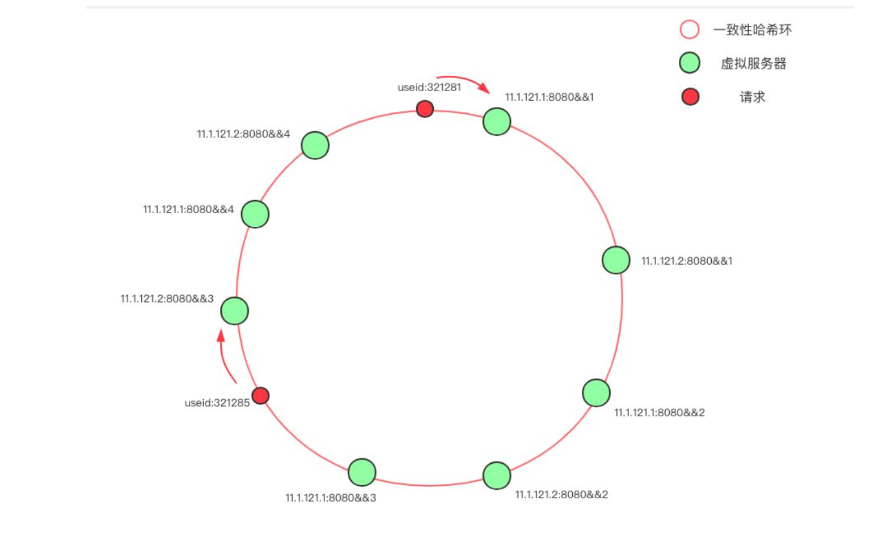

# 一致性哈希算法
## 介绍
负载均衡的概念可以抽象为：在$n$个候选服务器中，选择一个进行通信的过程。
负载均衡算法实现有多种：随机，轮询，最小负载优先等。
也包括一致性哈希算法：相同的请求尽可能落到统一服务器上。
在一致性哈希算法中，需要一个`key`进行`hash`计算。
这个`key`可以为：
1. 请求方`IP`;
2. 请求服务名称，参数列表构成的串；
3. 用户`ID`。

一致性哈希负载均衡设计思路：
> 1. 尽量保证每个服务器节点均匀分摊流量；
> 2. 尽可能保证服务器节点的上下线不影响流量的变更。

比较优秀的哈希算法：
> 1. `MurmurHash`算法：高运算性能，低碰撞率；
> 2. `FNV`算法：快速的`hash`大量的数据并保持较小的冲突率，适用于`hash`非常相近的字符串,如：`URL, hostname, 文件名, text, IP地址等`；
> 3. `Ketama`算法：一致性哈希算法。

## 一致性哈希算法实现
  
首先将服务器`(ip+port)`进行`hash`映射为环上的节点，当请求到来时，根据指定的`hash key`同样映射到环上，并顺时针选取最近的一个节点进行请求。
当环上服务器较少时，即使`hash`算法得当，也会有大量的请求落到同一个节点上的问题，为避免这个问题，大多数一致性哈希算法引入了虚拟节点的概念。
  
如图，我们将两个物理节点虚拟为多个节点，进行`hash`。物理节点越多，虚拟节点越少。

